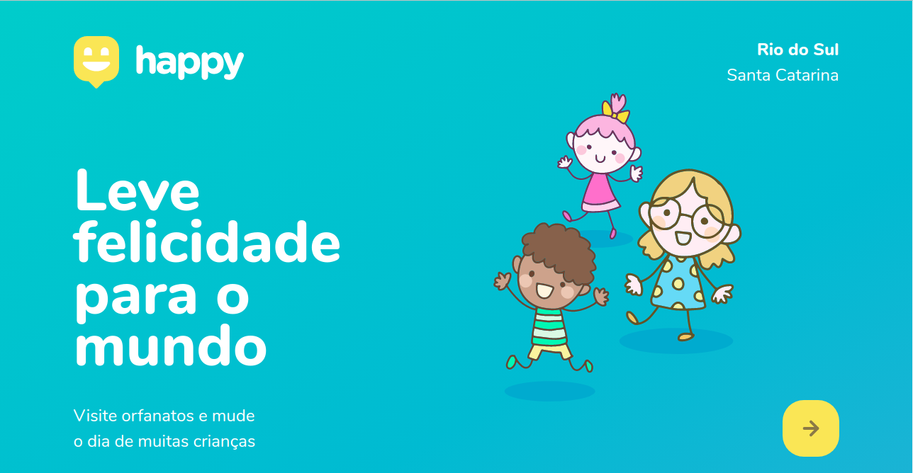
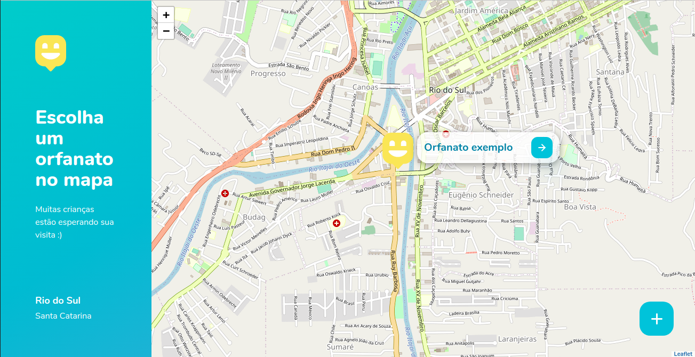
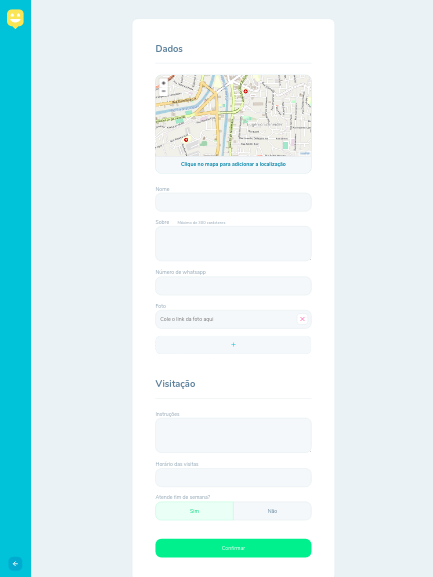

# Next Level Week 3 (Discovery)
A terceira edição do *next level week* ocorreu do dia 12 até o dia 18 com 5 dias de workshops onde construímos o projeto proposto pela *RockeatSeat*, foram 5 dias de muito conteúdo e mão na massa.
## Projeto
O projeto **Happy** foi idealizado como homenagem ao dia das crianças. É uma plataforma que permite cadastrar orfanatos com algumas informações, como:

* Localização
* Nome
* Sobre
* Número de contato(whatsapp)
* Imagens
* Instruções
* Horários de visitas
* Funcionalidade finais de semana

obs: As páginas foram criadas pensando em dispositivos como notebooks e desktops, apenas a página principal é responsiva.

## Técnologias utilizadas:
* HTML5
* CSS3
* JavaScript
* Node.js
* Express
* hbs
* SQLite

### Como baixar e exercutar:
~~~Shell
#clonar o repositório
$ git clone https://github.com/MoisesSantana/NLW3

#entrar no respositório
$ cd NLW

#instalar as dependências
$ npm install

#executar servidor
$ npm start

#Abra o site pela url http://localhost:5000
